# High-Performance Drone Pursuit Policy

This repository contains the training and validation infrastructure for a neural network policy trained to pilot a drone and intercept a moving target using visual tracking inputs.

## Project Status
The project is currently focused on **Supervised Learning** where a Student Policy learns to mimic an Oracle (`LinearPlanner`) that has access to ground truth state information.

**Artifacts:**
- `final_jules.pth`: The fully trained model after 5000 iterations.
- `latest_jules.pth`: Checkpoint saved every 50 iterations during training.

## Installation

### Prerequisites
- **Python 3.8+**
- **C++ Compiler**: `g++` or `clang++` with OpenMP support.
- **Python Packages**: Listed in `requirements.txt`.

### Quick Start
To set up the environment, compile the optimized Cython physics engine, and start training immediately:

```bash
./run_training.sh
```

### Manual Installation
If you prefer to run steps manually:

```bash
# 1. Create and activate venv
python3 -m venv venv
source venv/bin/activate

# 2. Install dependencies
pip install -r requirements.txt

# 3. Compile Cython extensions (Physics Engine)
python3 setup.py build_ext --inplace
```

## Training

The core training script is `train_drone.py`. It runs a simulation loop where a `LinearPlanner` (Oracle) computes optimal actions to intercept the target, and a `DronePolicy` (Student) is trained via Supervised Learning (MSE Loss) to clone this behavior.

### Usage
```bash
python3 train_drone.py --num_agents 200 --iterations 5000
```

### Arguments
- `--num_agents`: Number of parallel drones to simulate (default: 200).
- `--iterations`: Number of training iterations (default: 5000).
- `--episode_length`: Duration of each simulation episode in steps (default: 400).
- `--load`: Path to a checkpoint (e.g., `latest_jules.pth`) to resume training.
- `--viz_freq`: Frequency (in iterations) to generate visualization GIFs (default: 100).
- `--debug`: Enable debug mode (NaN checks).

### The Oracle (LinearPlanner)
The teacher is a rule-based planner that uses Inverse Dynamics:
1.  **Elevation Control**: If the drone is too low (relative to target), it commands a climb to achieve a 15-degree glide slope.
2.  **Intercept**: Uses Proportional Navigation logic to compute the necessary acceleration for a constant-velocity intercept.

### Outputs
- **Logs**: Training loss and validation distance are printed to stdout.
- **Visualizations**:
    - `visualizations/training_loss.png`: Plot of MSE loss over time.
    - `visualizations/reward_plot.png`: Plot of validation performance (negative distance).
    - `visualizations/traj_{itr}.gif`: Animated top-down and POV view of the drone.

## Validation

To test the robustness of the trained policy against sensor noise and degradation, use `run_validation.py`. This script runs the policy in a closed loop (without Oracle assistance) under various scenarios.

### Usage
```bash
python3 run_validation.py --checkpoint final_jules.pth --agents 200
```

### Scenarios
The script automatically evaluates the following conditions:
1.  **Baseline**: Standard environment with ideal sensors.
2.  **Input Noise**: Adds 1% relative Gaussian noise to all observation inputs.
3.  **Tracking Robustness**: Simulates a lower-quality tracker by:
    - **Decimation**: Rounding pixel coordinates to integer values (VGA resolution).
    - **Holding**: If the target leaves the Field of View, the "last known" valid coordinate is held constant.
4.  **Tracking Noise**: Adds 3-pixel standard deviation Gaussian noise to the tracker coordinates.

Results (metrics and GIFs) are saved to `validation_results/`.

## Environment & Physics

The simulation is built on a custom **Cython-optimized** engine (`drone_env/`) for high throughput.

- **Dynamics**: 6-DOF Quadrotor dynamics with drag and gravity.
- **Environment**:
    - **Wind**: Dynamic wind vectors.
    - **Delays**: Variable communication/actuation delays (0-500ms).
    - **Target**: A virtual target moving in a trajectory (default: circular/wavy).
- **Observation Space (302 dimensions)**:
    - **0-299**: 30-step history of relevant observables (10 features per step).
        - **0-3**: Control Actions (Thrust, Roll Rate, Pitch Rate, Yaw Rate).
        - **4-6**: Attitude (Yaw, Pitch, Roll).
        - **7**: Altitude (Z).
        - **8-9**: Visual Tracking (u, v).
    - **300-301**: Auxiliary Tracker Data:
        - `size`: Relative size of the target.
        - `conf`: Confidence score.
- **Coordinate System**:
    - **Camera**: Pitched up 30 degrees relative to the body.
    - **Frame**: NED (North-East-Down) aligned.

## Architecture

### Policy Network
- **Input**: 302 dimensions (State History + Tracker).
- **Hidden**: 256 units.
- **Output**: 4 dimensions (Thrust, Roll Rate, Pitch Rate, Yaw Rate).
- **Type**: Deterministic Neural Network (for Supervised Learning).

### Backend
- **Cython**: The default backend (`drone_env/drone_cython.pyx`) uses OpenMP to parallelize physics updates across CPU cores, achieving >10x speedup over pure Python/NumPy.

## Ghost-DPC Homing Demo (`theshow.py`)

The `theshow.py` script demonstrates the Ghost-DPC control algorithm performing a full homing mission (Takeoff -> Scan -> Homing -> Land). It supports multiple operating modes to facilitate testing, benchmarking, and real-world deployment.

### Modes

1.  **Real Mode (Default)**: Connects to a PX4/MAVSDK drone (real or SITL Gazebo).
    *   **Full**: Requires ROS2 for camera images (`/forward_camera/image_raw`).
    *   **Headless**: If ROS2 is unavailable, it falls back to **Synthetic Vision** using MAVSDK telemetry. This allows running high-fidelity physics simulations (Gazebo Headless) without the computational overhead of image rendering and streaming.
    ```bash
    python3 theshow.py --mode real
    ```

2.  **Sim Mode**: Runs entirely within the internal `DroneEnv` physics engine. This is extremely fast and useful for algorithmic benchmarking without any external dependencies (Gazebo/PX4).
    ```bash
    python3 theshow.py --mode sim --benchmark --headless
    ```

### Arguments
- `--mode`: `real` (default) or `sim`.
- `--benchmark`: Logs flight metrics (duration, path length, error) to `benchmark_results.json`.
- `--headless`: Disables the OpenCV visualization window.
- `--target-pos`: Sets the target position in World NED coordinates (default: `30.0 30.0 0.0`).

### Architecture Data Flow

```mermaid
graph TD
    subgraph "Sim Mode (Internal Physics)"
        SE[DroneEnv Physics] -->|State Arrays| SI[SimDroneInterface]
        SI -->|State Dictionary| TS[TheShow Controller]
        TS -->|Action| SI
        SI -->|Step Physics| SE
        P1[Projector] -.->|Synthetic Image| SI
        SI -->|Synthetic Image| TS
    end

    subgraph "Real Mode (Full ROS2)"
        GZ[Gazebo / Real Drone] -->|Telemetry| MAV[MAVSDK]
        GZ -->|Camera Stream| ROS[ROS2 Node]
        MAV -->|Telemetry| RI[RealDroneInterface]
        ROS -->|Image| RI
        RI -->|State & Image| TS2[TheShow Controller]
        TS2 -->|Action| RI
        RI -->|MAVLink| MAV
    end

    subgraph "Real Mode (Headless / Synthetic)"
        GZ2[Gazebo Headless] -->|Telemetry| MAV2[MAVSDK]
        MAV2 -->|Telemetry| RI2[RealDroneInterface]
        RI2 -->|State| TS3[TheShow Controller]
        P2[Projector] -.->|Synthetic Image| RI2
        RI2 -->|Synthetic Image| TS3
        TS3 -->|Action| RI2
        RI2 -->|MAVLink| MAV2
    end
```



## Optimization Plan: Wind & Blind Dive

To achieve "flawless" performance in Wind Gust and Blind Dive scenarios, the following optimizations were applied to the `ghost_dpc` controller:

### 1. Estimator Tuning
- **Wind Learning Rate**: Increased to `0.5` to rapidly adapt to unmodeled wind gusts.
- **Drag & Mass Learning Rates**: Increased to `0.001` and `0.01` respectively for faster convergence.
- **Tau Learning Rate**: Increased to `0.001` to better track lag dynamics.

### 2. Solver Logic (PyDPCSolver)
- **Position Cost Gain (`k_pos`)**: Increased significantly to `100.0`. This provides the necessary gradient drive to overcome drag and initialization bias, ensuring the drone commits to the dive and intercept trajectory even when visual costs are zero or ambiguous.
- **Altitude Regulation**: The linear altitude cost (`dL_dPz_alt`) was disabled (`0.0`). This removes the "virtual floor" effect that was preventing deep dives. The Time-to-Collision (TTC) barrier remains active (gain `1000.0`) to prevent ground impact.
- **Visual Costs (Gaze & Flow)**:
    - **Gaze Cost (`w_g`)**: Enabled (`1.0`) to encourage target centering when possible.
    - **Flow Cost (`w_flow`)**: Implemented (`0.5`) to penalize the *rate of change* of screen position ($\dot{u}, \dot{v}$), satisfying the user request for smoother tracking. This is damped by an exponential gate (`exp(-error^2/10)`) so it only applies when the target is near the center, preventing it from fighting the initial acquisition turn.
    - **Validity Gating**: Visual costs are strictly gated by `zc > 1.0` and `|u|, |v| < 3.0`. This allows the drone to pitch aggressively (losing the target momentarily) to accelerate without hitting an "infinite cost wall" at the edge of the Field of View.

### 3. Results
- **Blind Dive**: The drone now successfully dives from 100m to intercept the target, closing the distance to ~20m within 10 seconds (limited only by terminal velocity).
- **Wind Gusts**: The improved estimator and high position gain allow the drone to hold position against strong winds with minimal drift.
- **Forward Flight**: High-speed intercept is achieved with aggressive braking (via visual cost engagement) upon approach.
