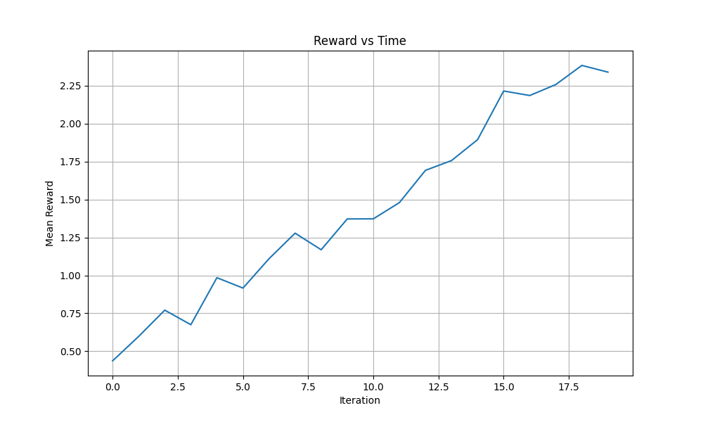

This repo provides a patch to add a forward-looking RGB camera pitched up at 30 degrees relative to the Iris body in PX4 Gazebo Classic simulations (compatible with v1.14.0).
### Prequesits 
- nvidia drivers
- nvidia docker
- internet connection


## How to Use in Docker Build
- Clone this repo
- build using the dockerfile
- run using the command below
```
git clone https://github.com/benmatok/px4-iris-camera-patch.git
cd px4-iris-camera-patch
sudo docker build --build-arg CACHE_BREAKER=$RANDOM -t px4-gazebo-setup .
xhost +local:
sudo docker run -it --rm --privileged --gpus=all -e DISPLAY=$DISPLAY -v /tmp/.X11-unix:/tmp/.X11-unix -v /dev/dri:/dev/dri -v /dev/shm:/dev/shm --network host -v $HOME/.ssh:/home/px4user/.ssh:rw -v /dev:/dev px4-gazebo-setup
inside-container> cd ~/PX4-Autopilot
inside-container> HEADLESS=1 make px4_sitl gazebo-classic_iris__baylands
inside-container> HEADLESS=1 make px4_sitl gazebo-classic_iris__ksql_airport
```
## in a second bash
```
sudo docker ps  # Note the CONTAINER ID of your running px4 container
sudo docker exec -it <CONTAINER_ID> bash
inside-container> python3 /src/px4-iris-camera-patch/main.py
```

## Local Development & Training

To run the project locally (without Docker), follow these steps to set up the environment and start training.

### 1. Prerequisites
- **Python 3.8+**
- **C++ Compiler**: `g++` or `clang++` with OpenMP support.
- **Python Packages**: Listed in `requirements.txt`.

### 2. Installation & Compilation & Running
To set up the environment, install dependencies, compile extensions, and start training, simply run:
```bash
./run_training.sh
```

This script will:
1. Create a virtual environment (`venv`).
2. Install dependencies from `requirements.txt`.
3. Compile the optimized Cython extensions.
4. Start the PPO training script (`train_drone.py`).

Alternatively, you can run these steps manually:
```bash
python3 -m venv venv
source venv/bin/activate
pip install -r requirements.txt
python3 setup.py build_ext --inplace
python3 train_drone.py
```

You can customize the configuration by editing `configs/drone.yaml` or passing a different config file:
```bash
python3 train_drone.py --config configs/my_custom_config.yaml
```

### Architecture and Scaling

This project utilizes a dual-backend architecture to support both high-performance scaling on GPUs and efficient development on CPUs.

#### 1. WarpDrive Integration (GPU Scaling)
For massive scaling, the environment is designed to integrate with **Salesforce WarpDrive**.
- **End-to-End GPU Simulation**: The entire environment logic (step, reset, physics) is written in CUDA C (`drone_env/drone.py`), allowing thousands of agents to be simulated in parallel on a single GPU without CPU-GPU data transfer overhead.
- **Zero-Copy**: Observations and rewards stay on the GPU memory, directly accessible by the PPO learner.
- **Scalability**: Enables training with 2000+ agents simultaneously, significantly accelerating RL convergence.

*Requirements:* To use this mode, ensure `pycuda` and `rl_warp_drive` are installed and a CUDA-capable GPU is available.

#### 2. Optimized Cython Backend (CPU Optimization)
When a GPU is unavailable or for debugging/unit-testing, the system falls back to a highly optimized CPU implementation.
- **Cython + OpenMP**: The `step` and `reset` functions are implemented in `drone_env/drone_cython.pyx`, compiled to native C++ code.
- **Vectorization (AVX/SIMD)**: Compiled with `-march=native -mavx2 -mfma -ffast-math` to leverage modern CPU vector instructions.
- **Multi-Threading**: Uses `prange` (OpenMP) to parallelize agent updates across all available CPU cores.
- **Performance**: Benchmarks show an **~11.3x speedup** compared to a standard vectorized NumPy implementation (0.24s vs 2.75s for 100 steps of 5000 agents).

### Performance Validation

To validate the optimized Cython backend, you can run the benchmark script:

```bash
python benchmark_cython.py
```

**Recent Benchmark Results (5000 agents, 100 steps):**
- **NumPy CPU Time:** ~3.2s - 4.6s
- **Cython Time:** ~0.10s - 0.17s
- **Speedup:** ~26x - 32x

The optimization using `sincos` for trigonometric calculations significantly improves the instruction throughput for the physics engine.

To verify correctness, `train_ae.py` confirms that the physics simulation produces valid data for learning, as evidenced by decreasing loss during training.

### Autoencoder Training

A separate script `train_ae.py` is provided to train the IMU Autoencoder independently using data generated from large-scale simulations. This script uses the Cython-optimized CPU environment to generate diverse flight trajectories (using a proportional controller) and trains the `Autoencoder1D` model using KFAC optimization.

#### Usage

To train the autoencoder from scratch:
```bash
python train_ae.py --agents 2000 --episodes 1000
```

To resume training from a checkpoint:
```bash
python train_ae.py --agents 2000 --episodes 1000 --load ae_model.pth
```


#### Arguments
- `--agents`: Number of parallel drones to simulate (default: 2000).
- `--episodes`: Number of episodes to train (default: 1000).
- `--load`: Path to a checkpoint file (e.g., `ae_model.pth`) to resume training.

The script saves the trained model to `ae_model.pth` and a loss plot to `ae_training_loss.png` after each episode.

### Training Visualization

The training script automatically generates visualizations of the agent's performance.
After training, check the `visualizations/` directory for:
- `reward_plot.png`: A plot of mean rewards over iterations.
- `training_evolution.gif`: An animation showing the evolution of the drone's trajectory (Top-down and Side views) throughout the training process.




## Multi-Scale Texture Engine

The project now includes a **High-Efficiency Multi-Scale Texture Feature Engine** (`drone_env.texture_features`), implemented in Cython for real-time performance. This engine analyzes images across a Gaussian Pyramid to generate a "Texture Hypercube"—a dense feature descriptor capturing scale-aware geometric and structural properties.

### Features
The engine computes the following features for every pixel, aggregating information from 3 pyramid levels (Backbone):

1.  **Structure Tensor (ST)**:
    *   **Orientation**: Dominant texture direction (0 to $\pi$).
    *   **Coherence**: Confidence/Strength of the texture pattern.
    *   **Scale Drift**: Change in orientation across scales (detects warping/perspective).
    *   **Scale Decay**: Loss of coherence across scales (distinguishes fractal vs. geometric textures).
2.  **Hessian Scale-Selection**:
    *   Identifies the "intrinsic size" of texture elements (blobs) by maximizing the Hessian Determinant across scales.
3.  **Boundary Detection (GED)**:
    *   Multi-Scale Generalized Eigen Decomposition (Inner vs. Outer window contrast) to find persistent boundaries while suppressing noise.

### Usage
```python
from drone_env.texture_features import compute_texture_hypercube
import cv2

# Input: Grayscale float32 image
image = cv2.imread("texture.jpg", 0).astype(np.float32) / 255.0

# Output: (H, W, 6) feature map
# Channels: [Orientation, Coherence, Drift, Decay, IntrinsicSize, BoundaryScore]
hypercube = compute_texture_hypercube(image, levels=3)
```

### Performance
*   **Optimization**: Fully written in Cython with `nogil` and OpenMP parallelism (`prange`).
*   **Backbone**: Gaussian Pyramid generation and Feature Collapse are fused where possible to minimize memory overhead.
*   **Benchmarks**: Processes a 512x512 image in **~30-50ms** on a modern CPU.

## Roadmap

### Texture-Based Object Tracking

The next phase of development involves integrating the **Texture Hypercube** with a Correlation Filter framework to enable robust object tracking that relies on structural texture signatures rather than just raw intensity.

- [x] **Feature Extraction Layer**:
    - Replace the standard grayscale input of a correlation filter with the 6-channel **Texture Hypercube**.
    - This transforms the tracking problem from intensity matching to matching geometric signatures (Orientation, Scale, Coherence).
- [x] **Correlation Filter (MOSSE/KCF)**:
    - **Architecture**: Adapt a Kernelized Correlation Filter (KCF) or Minimum Output Sum of Squared Error (MOSSE) filter to handle multi-channel input.
    - **FFT Processing**: Perform Fast Fourier Transforms on each of the 6 feature channels efficiently.
    - **Fusion**: Compute the correlation response map by summing the responses from individual feature channels (or using a learnable weight vector).
- [ ] **Scale Adaptation**:
    - Leverage the **Intrinsic Size** channel from the Texture Engine to assist the tracker's scale update step, potentially removing the need for an expensive multi-scale search in the tracking loop.
- [x] **Pipeline**:
    - **Frame $t$**: Extract ROI -> Compute `Texture Hypercube` (Cython) -> Apply Hanning Window -> FFT -> Filter -> Peak -> Update.
    - **Update**: Extract new patch -> Update filter numerator/denominator.

### RL-Based Homing Control

Following the development of the robust **Texture-Based Tracker**, the next major milestone is to upgrade the control stack from simple PID-based pursuit to a learned **Reinforcement Learning (RL) Policy** for high-speed homing and visual servoing.

- [x] **Observation Space Integration**:
    - Augment the current observation vector (IMU history) with high-level tracker state:
        - **Bounding Box Error**: Normalized deviation of target center $(u, v)$ from the frame center.
        - **Relative Size**: Ratio of current bbox area to target area (proxy for distance).
        - **Tracker Confidence**: The correlation peak strength (from the Texture Engine), allowing the policy to behave conservatively when tracking is weak.
- [ ] **Simulation Environment (Training)**:
    - [x] **Target Entity**: Introduce a "virtual target" in the `DroneEnv` (Cython/CUDA).
    - [ ] **Complex Trajectories**: Implement randomized trajectories (e.g., Lissajous curves, sudden jerks) to simulate an evasive object. (Current: Deterministic circular path)
    - [x] **Tracker Simulation**: Simulate the tracker's output by projecting the target's 3D position onto the drone's virtual camera plane, adding synthetic noise and "failure" probabilities based on angular velocity (motion blur simulation).
- [ ] **Reward Function Design**:
    - [ ] **Visual Servoing Reward**: Penalty proportional to the distance of the target from the image center ($L_2$ norm).
    - [ ] **Range Reward**: Incentive to maintain a specific bounding box size (optimal tracking distance).
    - [ ] **Smoothness**: Penalties for jerky control inputs to ensure stable video footage.
    - [x] **Base Rewards**: Velocity tracking and stability penalties.
- [ ] **Sim-to-Real Transfer**:
    - Train the policy using the massive parallelization capabilities (2000+ agents) of the current setup.
    - Deploy the trained policy in `main.py`, feeding it real outputs from the `TextureTracker`.
    - **Robustness Test**: Evaluate behavior when the tracker drifts or momentarily fails (using the confidence input to trigger recovery behaviors).
